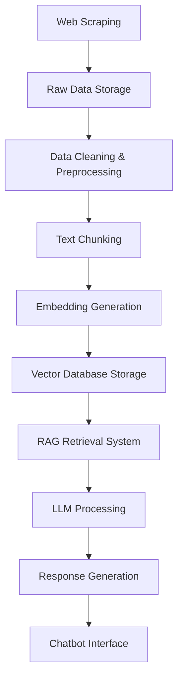

# RAG Knowledge System: Arquitectura Escalable para Chatbot Empresarial

## 🏗️ Visión Arquitectónica

Este proyecto implementa un sistema de **Retrieval-Augmented Generation (RAG)** escalable y robusto para la construcción de chatbots empresariales basados en conocimiento específico extraído mediante web scraping. La arquitectura sigue principios de **Clean Architecture** y **Domain-Driven Design** para garantizar mantenibilidad, escalabilidad y testabilidad.

## 📊 Arquitectura del Sistema

```
┌─────────────────────────────────────────────────────────────────┐
│                        PRESENTATION LAYER                       │
├─────────────────────────────────────────────────────────────────┤
│  Streamlit UI  │  REST API  │  WebSocket  │  CLI Interface      │
└─────────────────────────────────────────────────────────────────┘
                                    │
┌─────────────────────────────────────────────────────────────────┐
│                        APPLICATION LAYER                        │
├─────────────────────────────────────────────────────────────────┤
│  Chatbot Service  │  RAG Orchestrator  │  Query Processor      │
└─────────────────────────────────────────────────────────────────┘
                                    │
┌─────────────────────────────────────────────────────────────────┐
│                          DOMAIN LAYER                           │
├─────────────────────────────────────────────────────────────────┤
│  Document Models  │  Embedding Models  │  Query Models          │
│  RAG Chain Logic  │  Prompt Templates  │  Business Rules        │
└─────────────────────────────────────────────────────────────────┘
                                    │
┌─────────────────────────────────────────────────────────────────┐
│                      INFRASTRUCTURE LAYER                       │
├─────────────────────────────────────────────────────────────────┤
│  Scrapy Engine   │  Vector Database   │  LLM Providers         │
│  Data Pipeline   │  Caching Layer     │  Monitoring Stack      │
└─────────────────────────────────────────────────────────────────┘
```

## 🏭 Componentes Principales

### 1. **Scraping Engine** (Basado en Scrapy)
- **Justificación**: Scrapy es el framework más robusto para web scraping a escala empresarial [1]
- **Características**:
  - Middleware personalizado para rotación de proxies y user agents
  - Pipeline de procesamiento para limpieza automática de datos
  - Sistema de colas distribuidas con Redis para manejo de requests
  - Manejo inteligente de rate limiting y respeto de robots.txt

### 2. **Data Processing Pipeline** 
- **Chunking Strategies**: Implementación de múltiples estrategias basadas en:
  - **Semantic Chunking**: Utilizando spaCy para segmentación semántica [2]
  - **Recursive Character Text Splitter**: Para documentos largos con overlap configurable
  - **Document-specific chunking**: Adaptado al tipo de contenido (HTML, PDF, etc.)

### 3. **Vector Database Layer**
- **Opciones Soportadas**:
  - **ChromaDB**: Para desarrollo local y prototipado rápido
  - **Pinecone**: Para producción con alta escalabilidad [3]
  - **Weaviate**: Para casos que requieren grafos de conocimiento [4]
- **Justificación**: Abstracción que permite cambiar entre proveedores según necesidades

### 4. **RAG Implementation** (LangChain Framework)
- **Retrieval System**:
  - Hybrid search (dense + sparse vectors) para mejor precisión [5]
  - Re-ranking con Cross-Encoder para mejorar relevancia
  - Query expansion para manejar sinónimos y variaciones
- **Generation System**:
  - Template system robusto para prompt engineering
  - Chain-of-thought prompting para respuestas complejas
  - Soporte para múltiples LLM providers

### 5. **LLM Abstraction Layer**
- **Providers Soportados**:
  - **Ollama**: Para modelos open-source (Llama 3, Mistral, CodeLlama)
  - **OpenAI**: Para GPT-4, GPT-3.5-turbo
  - **Anthropic**: Para Claude models
  - **Custom endpoints**: Para modelos propietarios
- **Features**:
  - Fallback automático entre providers
  - Cost optimization y rate limiting
  - Response caching para consultas frecuentes

### 6. **Monitoring & Observability**
- **Logging**: Structured logging con ELK Stack compatibility
- **Metrics**: Prometheus-compatible metrics para latencia, throughput, y accuracy
- **Tracing**: Distributed tracing para debugging del pipeline RAG
- **Health Checks**: Endpoints para monitoreo de todos los componentes

## 🔧 Tecnologías y Justificaciones

| Componente | Tecnología | Justificación |
|------------|------------|---------------|
| Web Scraping | **Scrapy** | Framework más maduro para scraping empresarial, manejo robusto de concurrencia [1] |
| Text Processing | **spaCy + NLTK** | spaCy para NLP moderno, NLTK para tareas específicas de limpieza [2] |
| Vector Embeddings | **sentence-transformers** | State-of-the-art para embeddings semánticos multiidioma [6] |
| Vector Database | **ChromaDB/Pinecone** | ChromaDB para desarrollo, Pinecone para escala production [3] |
| RAG Framework | **LangChain** | Ecosistema más completo para aplicaciones LLM empresariales [7] |
| API Framework | **FastAPI** | Performance superior y documentación automática [8] |
| UI Framework | **Streamlit** | Prototipado rápido para interfaces de ML/AI [9] |
| Containerization | **Docker + Docker Compose** | Estándar de la industria para deployment reproducible [10] |
| Queue System | **Redis + Celery** | Manejo asíncrono confiable para tareas de procesamiento [11] |

## 📁 Estructura del Proyecto

```
rag_knowledge_system/
├── 📂 src/                          # Código fuente principal
│   ├── 📂 scraping/                 # Motor de web scraping
│   │   ├── 📂 spiders/              # Arañas de Scrapy
│   │   ├── 📂 pipelines/            # Pipelines de procesamiento
│   │   ├── 📂 middlewares/          # Middlewares personalizados
│   │   └── 📂 items/                # Definición de items
│   ├── 📂 data_processing/          # Pipeline de procesamiento de datos
│   │   ├── 📂 chunking/             # Estrategias de segmentación
│   │   ├── 📂 cleaning/             # Limpieza y normalización
│   │   └── 📂 embeddings/           # Generación de embeddings
│   ├── 📂 vector_store/             # Abstracción de base de datos vectorial
│   ├── 📂 rag/                      # Sistema RAG
│   │   ├── 📂 retrievers/           # Lógica de recuperación
│   │   ├── 📂 chains/               # Cadenas de procesamiento
│   │   └── 📂 prompts/              # Templates de prompts
│   ├── 📂 llm/                      # Abstracción de modelos LLM
│   │   ├── 📂 providers/            # Proveedores (OpenAI, Ollama, etc.)
│   │   └── 📂 models/               # Configuración de modelos
│   ├── 📂 chatbot/                  # Interfaz de chatbot
│   │   ├── 📂 interface/            # UI con Streamlit
│   │   └── 📂 handlers/             # Lógica de manejo de mensajes
│   ├── 📂 core/                     # Funcionalidades base
│   │   ├── 📂 config/               # Configuración centralizada
│   │   ├── 📂 database/             # Abstracciones de DB
│   │   ├── 📂 logging/              # Sistema de logging
│   │   └── 📂 monitoring/           # Métricas y monitoreo
│   └── 📂 utils/                    # Utilidades compartidas
├── 📂 tests/                        # Suite de testing
│   ├── 📂 unit/                     # Tests unitarios
│   ├── 📂 integration/              # Tests de integración
│   ├── 📂 e2e/                      # Tests end-to-end
│   └── 📂 data/                     # Datos de prueba
├── 📂 config/                       # Archivos de configuración
│   ├── 📂 scrapy/                   # Configuración de Scrapy
│   ├── 📂 llm/                      # Configuración de LLMs
│   └── 📂 vector_db/                # Configuración de DB vectorial
├── 📂 scripts/                      # Scripts de automatización
│   ├── 📂 setup/                    # Scripts de instalación
│   ├── 📂 data_pipeline/            # Scripts de pipeline de datos
│   └── 📂 deployment/               # Scripts de deployment
├── 📂 data/                         # Almacenamiento de datos
│   ├── 📂 raw/                      # Datos crudos del scraping
│   ├── 📂 processed/                # Datos procesados
│   └── 📂 embeddings/               # Vectores generados
├── 📂 docs/                         # Documentación
│   ├── 📂 architecture/             # Documentos de arquitectura
│   ├── 📂 api/                      # Documentación de API
│   └── 📂 examples/                 # Ejemplos de uso
└── 📂 notebooks/                    # Jupyter notebooks para análisis
```

## 🚀 Pipeline de Datos



## 🔒 Consideraciones de Arquitectura

### **Escalabilidad**
- **Horizontal Scaling**: Cada componente puede escalarse independientemente
- **Load Balancing**: Nginx para distribución de carga en múltiples instancias
- **Caching Strategy**: Redis para caché de embeddings y respuestas frecuentes
- **Database Sharding**: Soporte para particionamiento de datos por dominio

### **Reliability**
- **Circuit Breaker Pattern**: Para manejo de fallos en servicios externos
- **Retry Logic**: Backoff exponencial para operaciones que fallan
- **Health Checks**: Monitoreo continuo de todos los servicios
- **Graceful Degradation**: El sistema funciona con funcionalidad reducida si algunos componentes fallan

### **Security**
- **API Rate Limiting**: Protección contra abuso de endpoints
- **Input Validation**: Sanitización de todas las entradas del usuario
- **Secrets Management**: Uso de variables de entorno para credenciales
- **HTTPS/TLS**: Cifrado en tránsito para todas las comunicaciones

### **Performance**
- **Asynchronous Processing**: Uso de async/await para operaciones I/O
- **Connection Pooling**: Reutilización eficiente de conexiones de DB
- **Batch Processing**: Agrupación de operaciones para mejorar throughput
- **Response Streaming**: Para respuestas de chatbot en tiempo real

## 📋 Instalación y Configuración

### Pre-requisitos
- Python 3.9+ (se recomienda 3.11)
- [uv](https://github.com/astral-sh/uv) - Gestor de paquetes ultrarrápido
- Docker y Docker Compose
- Make
- Git

### Instalación con uv (Recomendado)

```bash
# 1. Instalar uv (si no está instalado)
curl -LsSf https://astral.sh/uv/install.sh | sh

# 2. Clonar el repositorio
git clone https://github.com/your-org/rag-knowledge-system.git
cd rag_knowledge_system

# 3. Configuración rápida para nuevos desarrolladores
make quick-start

# 4. Configurar variables de entorno
cp .env.example .env
# Editar .env con tus API keys y configuraciones

# 5. Instalación completa del entorno de desarrollo
make setup
```

### Comandos Principales

```bash
# Ver todos los comandos disponibles
make help

# Ejecutar la aplicación
make run-api          # API FastAPI en http://localhost:8000
make run-streamlit    # Interfaz Streamlit en http://localhost:8501

# Pipeline de datos
make scrape           # Ejecutar web scraping
make process-data     # Procesar datos
make generate-embeddings  # Generar embeddings
make pipeline         # Pipeline completo

# Desarrollo
make format           # Formatear código
make lint            # Verificar calidad del código
make test            # Ejecutar tests
make check           # Formato + lint + tests

# Docker
make compose-up      # Levantar todos los servicios
make compose-down    # Detener servicios
```

### Instalación con Docker (Alternativa)

```bash
# 1. Clonar repositorio
git clone https://github.com/your-org/rag-knowledge-system.git
cd rag_knowledge_system

# 2. Configurar variables de entorno
cp .env.example .env
# Editar .env con tus configuraciones

# 3. Levantar servicios
docker-compose up -d

# 4. Verificar que los servicios estén corriendo
docker-compose ps
```

## 🧪 Testing y Validación

El proyecto incluye una suite completa de testing:
- **Unit Tests**: >90% coverage para lógica de negocio
- **Integration Tests**: Validación de componentes integrados
- **E2E Tests**: Flujos completos de usuario
- **Performance Tests**: Benchmarking de latencia y throughput

## 📈 Métricas y KPIs

- **Response Time**: <2s para consultas simples, <5s para consultas complejas
- **Accuracy**: >85% en respuestas relevantes (evaluado con conjunto de test)
- **Availability**: 99.5% uptime objetivo
- **Throughput**: >100 consultas/minuto por instancia

## 🔄 Roadmap

- [ ] Implementación de fine-tuning para modelos específicos de dominio
- [ ] Integración con GraphRAG para conocimiento estructurado
- [ ] Soporte multimodal (imágenes, documentos PDF)
- [ ] Integración con sistemas de CRM empresariales
- [ ] A/B testing framework para optimización de prompts

## 📚 Referencias

[1] Scrapy Documentation. (2024). "Scrapy: An open source web crawling framework for Python." https://scrapy.org/

[2] Honnibal, M., et al. (2020). "spaCy: Industrial-strength Natural Language Processing." https://spacy.io/

[3] Pinecone. (2024). "Vector Database for Machine Learning Applications." https://www.pinecone.io/

[4] Weaviate. (2024). "Open-source vector database." https://weaviate.io/

[5] Karpukhin, V., et al. (2020). "Dense Passage Retrieval for Open-Domain Question Answering." EMNLP 2020.

[6] Reimers, N., & Gurevych, I. (2019). "Sentence-BERT: Sentence Embeddings using Siamese BERT-Networks." EMNLP-IJCNLP 2019.

[7] LangChain. (2024). "Framework for developing applications with LLMs." https://langchain.com/

[8] Ramírez, S. (2024). "FastAPI: Modern, fast web framework for building APIs with Python." https://fastapi.tiangolo.com/

[9] Streamlit. (2024). "The fastest way to build and share data apps." https://streamlit.io/

[10] Docker Inc. (2024). "Docker: Accelerated Container Application Development." https://www.docker.com/

[11] Ask Solem. (2024). "Celery: Distributed Task Queue." https://celeryq.dev/

## 👥 Contribución

Este proyecto sigue las mejores prácticas de desarrollo:
- **Code Review**: Todas las PR requieren revisión
- **Continuous Integration**: Tests automáticos en cada commit
- **Documentation**: Documentación actualizada con cada feature
- **Semantic Versioning**: Versionado semántico para releases

## 📄 Licencia

MIT License - Ver archivo LICENSE para más detalles.

---

**Developed with ❤️ for Enterprise Knowledge Systems**