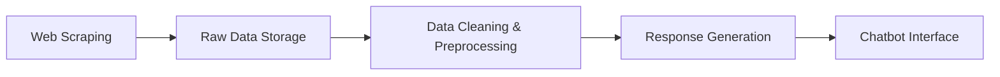
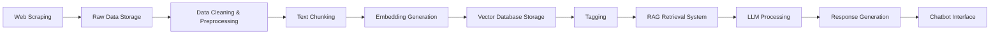

# RAG Knowledge System: Arquitectura Escalable para Chatbot Empresarial

## 👥 Integrantes del grupo

- Juan Jose Bonilla - 22502052
- Yan Carlos Cuaran Imbacuan - 22502591
- Nicolas Lozano Mazuera - 22500565
- Soren Acevedo - 22500566

## 🏭 Componentes Principales


### 1. **Scraping Engine** (Selenium, Requests, BeautifulSoup)

- **Características**:
  - Extracción de datos web usando Selenium para navegación y Requests para descargas directas
  - Parsing y limpieza básica con BeautifulSoup
  - No se implementó rotación de proxies, user agents ni manejo avanzado de rate limiting


### 2. **Data Processing Pipeline**

- **Procesamiento realizado:**
  - Conversión de datos extraídos a archivos de texto plano
  - No se han implementado estrategias de chunking, segmentación semántica ni procesamiento avanzado


### 3. **Vector Database Layer**

- **No implementado aún.**

### 4. **RAG Implementation** (LangChain Framework)

- **No implementado aún.**


### 5. **LLM Abstraction Layer**

- **Providers Soportados**:
  - **Ollama**
  - **OpenAI**
  - **Gemini**

- **Implementación actual:**
  - Abstracción de proveedores en `src/chatbot/providers/`.
  - Selección de modelo y proveedor desde la interfaz.


### 6. **Monitoring & Observability**

- **Logging**: Implementado en `src/core/logging/logger.py`.
- **Metrics, Tracing, Health Checks**: No implementados aún.


## 🔧 Tecnologías y Justificaciones

| Componente        | Tecnología                  | Justificación                                                                      |
| ----------------- | --------------------------- | ---------------------------------------------------------------------------------- |
| Web Scraping      | **Selenium, Requests, BeautifulSoup** | Herramientas estándar para scraping y parsing en Python                            |
| Text Processing   | **Python estándar**         | Conversión básica a texto plano                                                    |
| Vector Embeddings | **No implementado**         |                                                                                   |
| Vector Database   | **No implementado**         |                                                                                   |
| RAG Framework     | **No implementado**         |                                                                                   |
| API Framework     | **No implementado**         |                                                                                   |
| UI Framework      | **Streamlit**               | Prototipado rápido para interfaces de ML/AI [9]                                    |
| Containerization  | **No implementado**         |                                                                                   |
| Queue System      | **No implementado**         |                                                                                   |


## 📁 Estructura del Proyecto (actual)

```
├── app.py
├── LICENSE
├── Makefile
├── pyproject.toml
├── README.md
├── config/
│   └── models.yaml
├── data/
│   ├── embeddings/
│   ├── models/
│   ├── processed/
│   │   ├── context_colgate.txt
│   │   ├── context_palmolive.txt
│   │   ├── context_youtube.txt
│   │   ├── company_context.txt
│   ├── raw/
│   │   ├── company_data.json
│   │   ├── productos_colgate.csv
│   │   ├── productos_palmolive.csv
│   │   └── youtube_channel_videos.json
│   └── qa/
│       └── qa_colgate_palmolive.csv
├── src/
│   ├── __init__.py
│   ├── chatbot/
│   │   ├── providers/
│   │   │   ├── base.py
│   │   │   ├── gemini.py
│   │   │   ├── ollama.py
│   │   │   └── openai.py
│   ├── core/
│   │   ├── prompts.py
│   │   ├── config/
│   │   │   ├── model_loader.py
│   │   │   └── settings.py
│   │   ├── logging/
│   │   │   └── logger.py
│   ├── langchain/
│   │   ├── contexto.txt
│   │   └── ollama_test.py
│   ├── processing/
│   │   ├── chunking.py
│   │   ├── plain_company_processing.py
│   │   ├── plain_products_processing.py
│   │   ├── plain_youtube_processing.py
│   │   └── preprocessing.py
│   ├── scraping/
│   │   ├── colgate_palmolive.py
│   │   ├── colgate_productos.py
│   │   ├── fetch_social_media.py
│   │   └── palmolive_productos.py
│   │   └── driver/
└── ...
```

## 🚀 Pipeline de Datos

### Módulo 1: Pipeline sin chunking, embedding, vector db, tag



### Módulo 2: Pipeline con chunking, embedding, vector db, tag



## 📋 Instalación y Configuración

### Pre-requisitos

- Python 3.9+ (se recomienda 3.11)
- [uv](https://github.com/astral-sh/uv) - Gestor de paquetes ultrarrápido
- Docker y Docker Compose
- Make
- Git


### Comandos Principales

```bash
# Ejecutar la aplicación Streamlit
make start                # Inicia la interfaz Streamlit en http://localhost:8501

# Scraping de productos
make scrape-palmolive     # Scrapea productos Palmolive
make scrape-colgate       # Scrapea productos Colgate
make scrape-all           # Scrapea ambos productos

# Preprocesamiento a texto plano
make txt-products-preprocess   # Convierte productos a texto plano
make txt-youtube-preprocess    # Convierte datos de YouTube a texto plano
make txt-company-preprocess    # Convierte datos de empresa a texto plano
make txt-preprocess            # Ejecuta todos los preprocesamientos a texto plano

# Preprocesamiento general
make preprocess           # Preprocesa todos los datos

# Chunking (experimental)
make chunk                # Aplica chunking a los textos
```


## 📚 Referencias

- Selenium Documentation. (2025). "Selenium WebDriver for browser automation." https://www.selenium.dev/
- Requests Documentation. (2025). "Requests: HTTP for Humans." https://docs.python-requests.org/
- BeautifulSoup Documentation. (2025). "Beautiful Soup: HTML/XML parsing library." https://www.crummy.com/software/BeautifulSoup/bs4/doc/
- Streamlit Documentation. (2025). "Streamlit: The fastest way to build and share data apps." https://streamlit.io/

## 📄 Licencia

MIT License - Ver archivo LICENSE para más detalles.

---
